

South Korea’s drinking culture has been popularized by music videos and tv shows, but aside from the soju and beer, there are plenty of drinks that contribute to Korea’s rich food culture. From distilled liquors, wines, teas, and punches, drinking in Korea is valued with a long tradition.

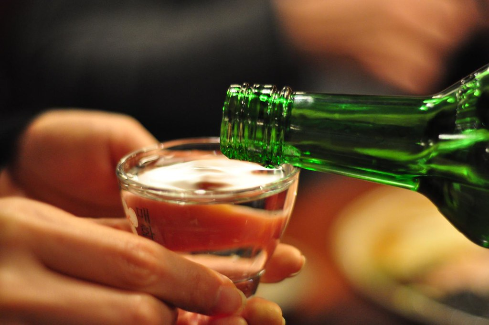

Graham Hill - Flickr

<h2 class="blog-header--2">Soju 소주</h2>

The most popular Korean alcoholic drink is soju. Actually, it’s one of the most popular liquors in the world. It is traditionally a distilled spirit made from rice, however modern soju can use a variety of different grains. Soju typically comes in an iconic small green glass bottle. Aside from the neutral flavor, there are a variety of popular fruit-flavored soju if you fancy a sweeter taste. 

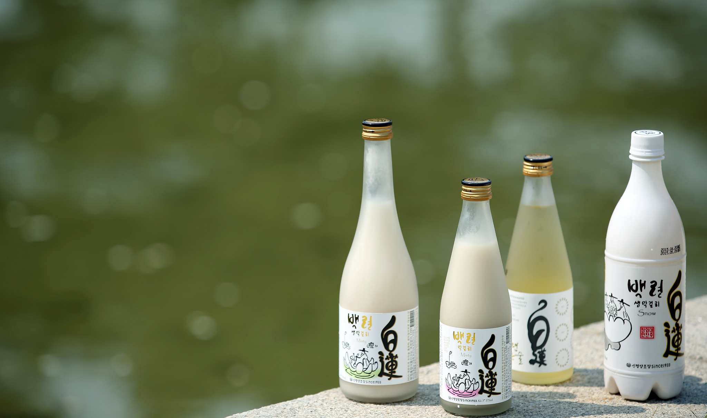

Republic of Korea - Flickr

<h2 class="blog-header--2">Makgeolli 막걸리</h2>

This rice wine has been around for a while (it’s the oldest traditional Korean drink) and used to be known as the farmer’s choice of drink because of its nutrients and carbonated quality. Makgeoli is taken from the unfiltered bottom layers of the fermentation, so it has a milky appearance and the taste is light, sweet, and fizzy (as opposed to Cheongju, which is made from the top clear layers of the fermentation). It’s best to drink it cold either shaken up or not. Careful though, because of its light flavor, you may not realize how much of the alcohol you’re actually drinking! 

<h2 class="blog-header--2 mt-5" id="maekju">Maekju 맥주</h2>

“Maekju” is the Korean word for beer. Along with Soju and Makgeoli, beer is one of the most popular alcoholic drinks in Korea. Kloud, Cass, and Hite are a few popular Korean beer brands. If you combine Soju and Maekju, you get “So-maek”. Just pour a shot of one into the other and you’ve got yourself a popular way of getting drunk fast. 

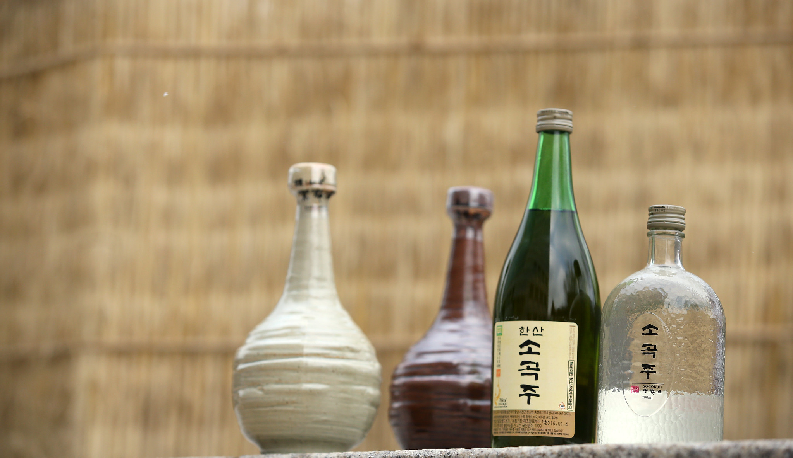

Republic of Korea - Flickr

<h2 class="blog-header--2" id="sogokju">Sogokju 소곡주</h2>

This traditional liquor is made from glutinous rice, yeast, and a 100 day fermentation period. The famous brand of sogokju is “Hansan Sogokju”, named after the village that brews it. The story goes that there is a scholar who was on his way to take an exam when he became thirsty. He stopped by and drank so much sogokju that he was unable to walk and thus, couldn’t go take his exam. This story has given sogokju the character of making people unable to walk after drinking. 

<h2 class="blog-header--2 mt-5" id="baekseju">Baekseju 백세주</h2>

Literally “100 year old” alcohol, Baekseju is an herbal wine made from rice like Cheongju and Makgeoli. It isn’t 100 years old, but it’s supposed to help you live to that age. Whereas Makgeoli is made from the bottom sediments of the fermentation and Cheongju is made from the top clear layer of the fermentation, Baekseju takes that clear wine and infuses it with ginseng and about a dozen other herbs. 

<h2 class="blog-header--2 mt-5" id="cheongju">Cheongju 청주</h2>

Cheongju means “clear liquor” and is the name for a rice wine. It uses the same fermentation process as Makgeoli, but uses the top clear layer of the fermentation rather than the bottom unfiltered layers. This makes it quite similar to Japanese sake. Cheongju is traditionally used in rituals and offerings like Charye and regarded in Korea as quality liquor.

<h2 class="blog-header--2 mt-5" id="insamju">Insamju 인삼주</h2>

A type of medicinal wine made by fermenting ginseng in a rice and malt liquor. Insamju is usually bit expensive, but it’s popular among the elderly and is typically paired with samgyetang (a chicken soup).

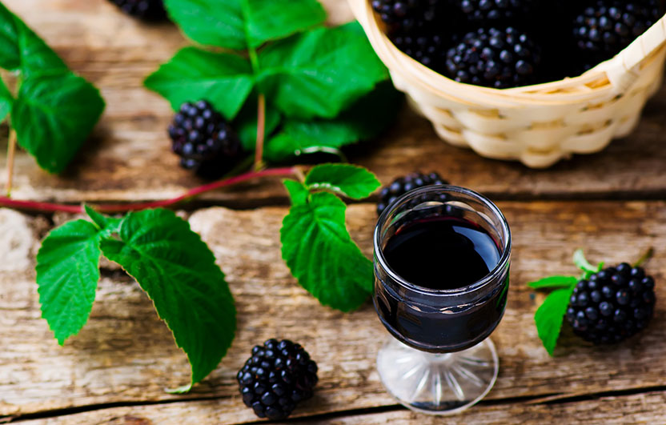
<h2 class="blog-header--2">Bokbunjaju 복분자주</h2>

A wine made from fermented blackberries. The alcohol content is a bit higher than your typical grape wine - while grape wine usually sits at 11%-13% ABV (Alcohol by Volume), bokbunja is usually around 15-19% ABV.

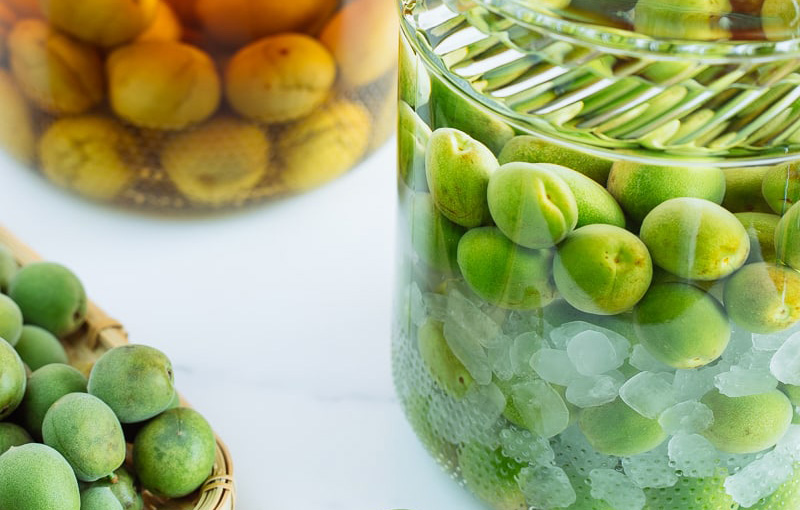

https://www.justonecookbook.com/plum-wine/

<h2 class="blog-header--2">Maesilju 매실주</h2>

This wine is made by fermenting ripe green/yellow plums, soju, and sugar or honey for at least 3 months. It is a sweet drink that is refreshing for any occasion. 

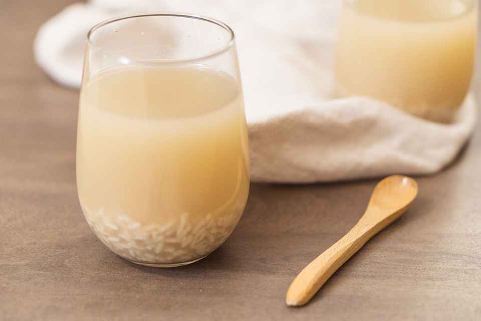

https://www.chopsticksandflour.com/sikhye-korean-sweet-rice-punch/

<h2 class="blog-header--2">Sikhye 식혜</h2>

Sikhye is a sweet cold drink made from cooked rice and malted barley. You can see grains of cooked rice and sometimes pine nuts floating around in the liquid. It’s usually served at the end of a meal as a dessert. Sikhye is a favorite for many because it’s non-alcoholic, so everyone can enjoy it! It takes a while to cook, but you can find it readily available in bottles or cans at grocery stores. 

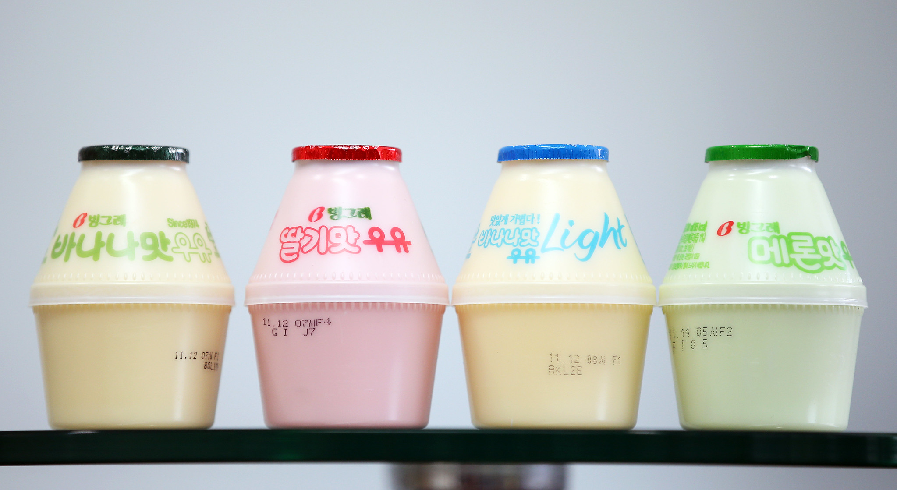

Republic of Korea - Flickr

<h2 class="blog-header--2" id="banana-milk">Banana milk 바나나맛 우유</h2>

It’s probably not an overstatement to say that everyone in Korea loves banana milk regardless of age. Binggrae’s banana milk has been made for over 40 years and has become a representative product of Korea. Generations of people grew up with banana milk. 

<h2 class="blog-header--2 mt-5" id="sujeonggwa">Sujeonggwa 수정과</h2>

Sujeonggwa is a Korean cinnamon punch that is typically consumed hot or cold during festive times. It’s considered a dessert drink like Sikhye and it’s great for digestion after a heavy meal. The main ingredients are cinnamon, ginger, and sugar, which makes it sweet and aromatic. 

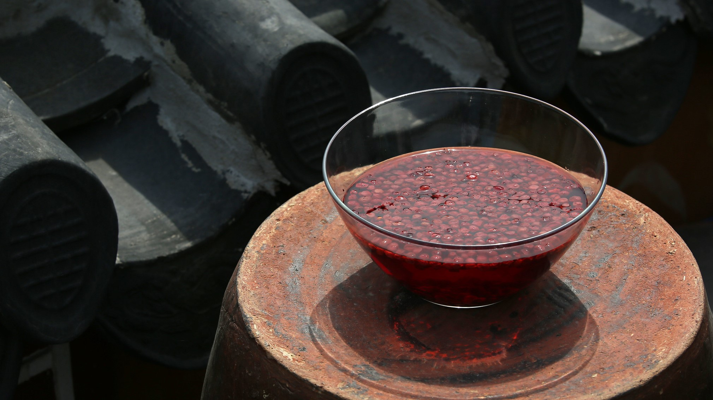

Republic of Korea - Flickr

<h2 class="blog-header--2" id="omija">Omija tea 오미자차</h2>

Omija is a small, red berry whose name literally translates to “five flavored berry”. It’s commonly used to make tea in its dried form, however fresh omija are harvested around Autumn. The five flavors refer to the taste of each layer of the berry. There are two ways of making omija tea. One way is to steep dried omija in cold water for about half a day. The second way is to make a syrup out of it, called omija cheong. This syrup can be mixed with water to make tea. 

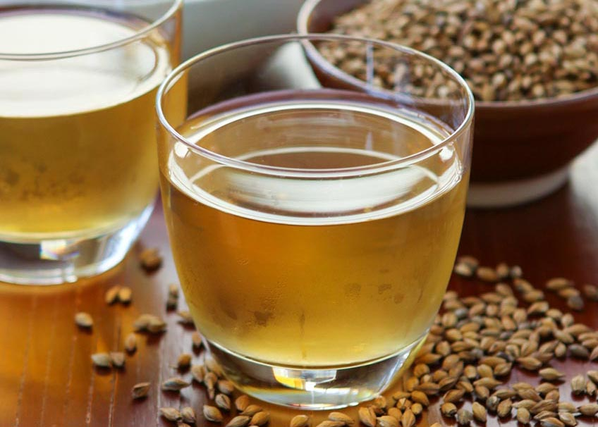

http://www.thirstyfortea.com/recipes/korean-barley-tea/

<h2 class="blog-header--2">Barley tea 보리차</h2>

Barley tea isn’t particularly a traditional Korean drink, but it’s popular in East Asia. This tea made from barley grains is a very healthy drink with numerous health benefits. It can be hot or cold, and is often sold in bottled form or in tea bags. 

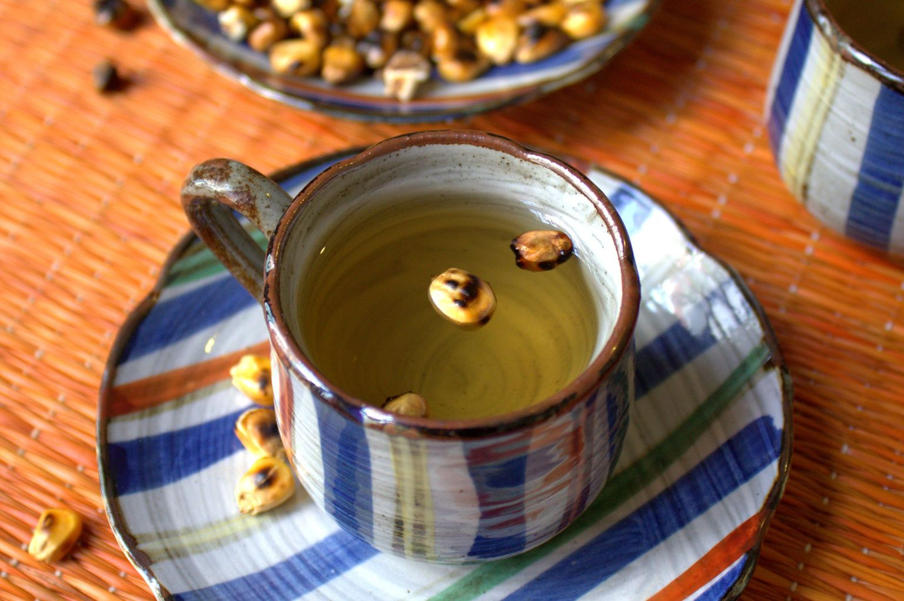

Kirthana - The Blurry Lime

<h2 class="blog-header--2" id="corn-tea">Corn tea 옥수수차</h2>

“Oksusu cha” is corn tea in Korean. It’s a traditional Korean tea made from the kernels or the corn silk. “Oksusu suyeom cha” refers specifically to corn tea made from corn silk. It’s a popular winter drink in Korea and you’ll often find it sold in tea-bags at stores.
 

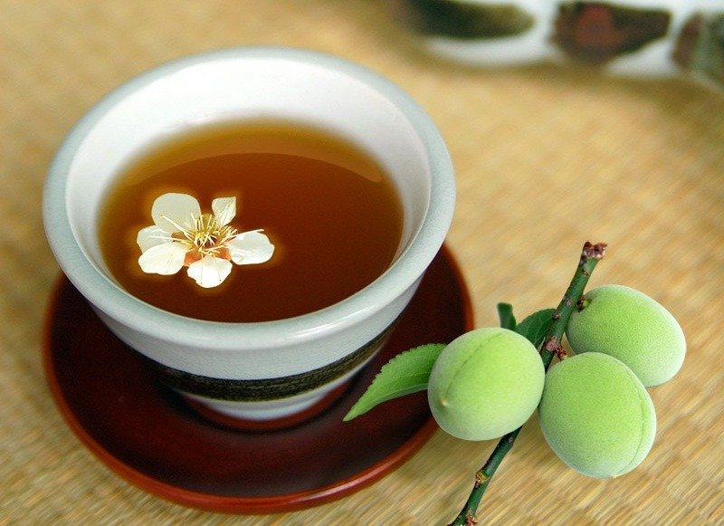
<h2 class="blog-header--2">Maesilcha 매실차</h2>

This is a traditional Korean plum tea made by mixing hot/cold water with a fermented plum syrup/marmalade. It’s nutritious and is great after a meal to help with digestion and ease the bowels. 

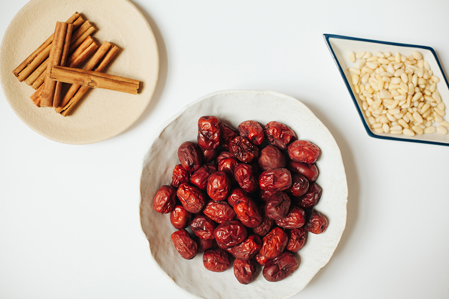

https://golubkakitchen.com/jujube-ginger-tea/

<h2 class="blog-header--2">Jujubes tea 대추차</h2>

This is a traditional Korea tea made with jujubes, or “daechu 대추”. Jujubes can be eaten fresh and whole, but it has more uses in cooking after it’s dried.

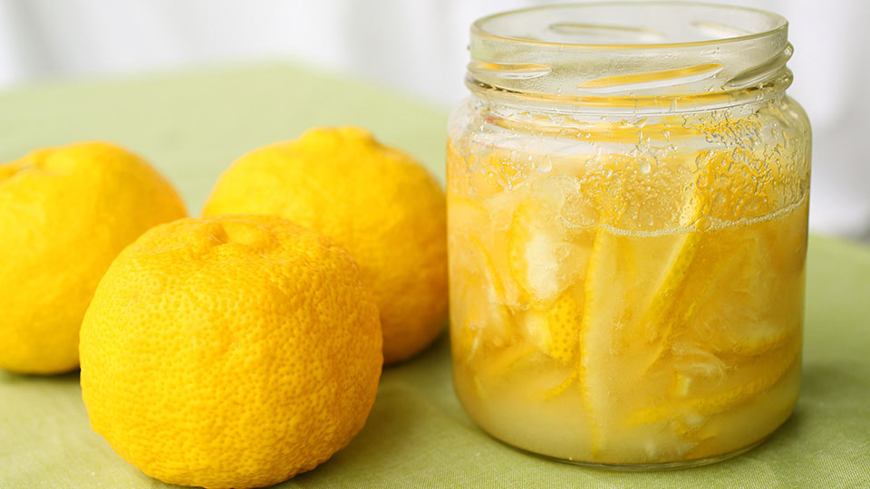

https://www.maangchi.com/recipe/yujacha

<h2 class="blog-header--2">Yuja tea 유자차</h2>

A traditional Korean tea made with yuja, citron, or yuzu. It’s made by curing the fruit into a syrup/marmalade which is then mixed with hot water to make tea. This syrup has a variety of other uses in cooking as well. 

    <h3 class="blog-link__header">Learn more</h3>
    

        
<u><b><a href="https://www.esquire.com/food-drink/drinks/a15050863/korean-rice-alcohol/" target="_blank" rel="noopener noreferrer">A Guide to Traditional Korean Rice Alcohol</a></b></u> - Esquire

        
<u><b><a href="https://vinepair.com/articles/soju-koreas-national-drink/" target="_blank" rel="noopener noreferrer">Soju: Everything You Need to Know About Korea’s National Drink</a></b></u> - Vinepair

        
<u><b><a href="https://www.vice.com/en_us/article/8qkm4z/makgeolli-is-the-drink-of-choice-for-farmers-korean-rappers-and-old-people" target="_blank" rel="noopener noreferrer">Makgeolli Is the Drink of Choice for Farmers, Korean Rappers, and Old People</a></b></u> - Vice

    

