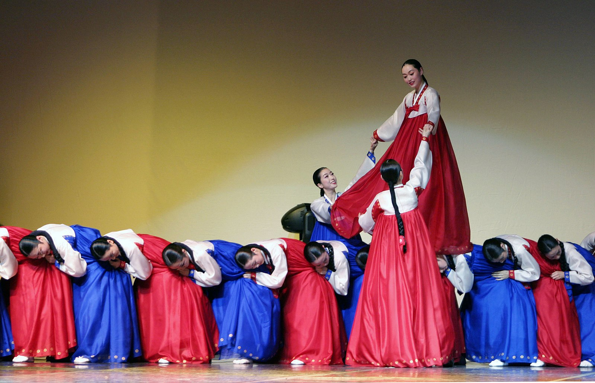
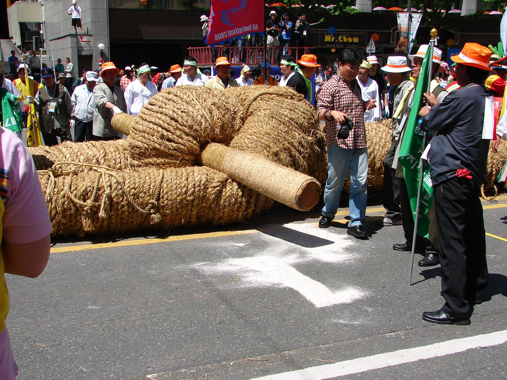
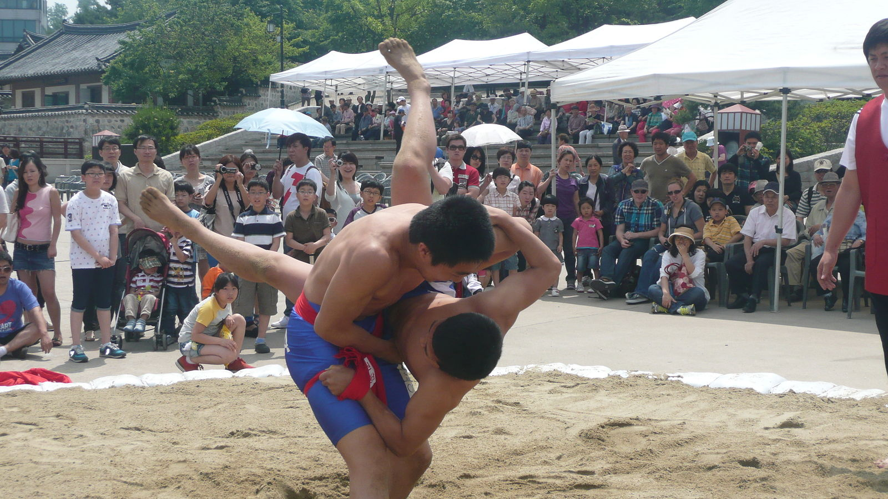
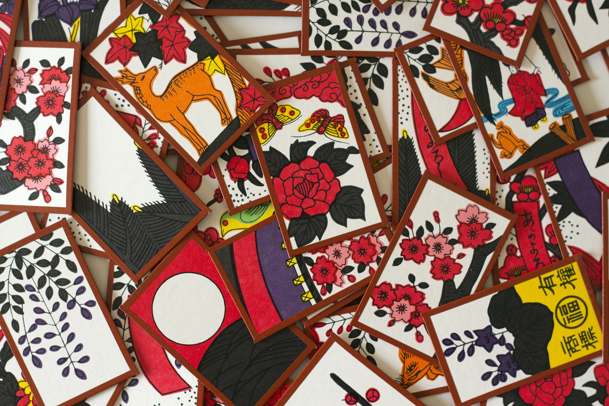

Traditional Korean games are referred to as Jeontongnori (전통놀이). There are many games that can be played with family and friends or with others at some traditional attractions.
Here is a list of some modern activities to enjoy with your loved ones.

Commons - Wikipedia

<h2 class="blog-header--2 mt-5">Ganggangsullae 강강술래</h2>

This is the most representative folk activity during the full moon of Chuseok and reflects Korea’s agrarian roots. It is a 5,000 year-old dance recognized and described by UNESCO as a “seasonal harvest and fertility ritual.” During the dance, women wear hanbok and gather in a circle and hold hands while playfully miming vignettes of rural life and repeating the name of the dance. The dance is preserved as a performing art today and taught in elementary schools. 

<a class="blog-p" href="https://www.youtube.com/watch?v=6D73WBzzEG4" target="_blank"><u>Click here to watch it</u></a>

Commons - Wikipedia

<h2 class="blog-header--2">Juldarigi 줄다리기</h2>

A tug-of-war game using an enormous hand-woven straw rope. Entire villages and counties would play traditionally. Dangjin and Yeongsan are some places that now famously hold the large-scale juldarigi events. Korea’s Juldarigi and three other countries rope-tugging rituals have been listed in UNESCO. Juldarigi used to be a ritual to bring about good fortune and a good harvest. Teams are divided by gender or region.

Commons - Wikipedia

<h2 class="blog-header--2">Ssireum 씨름</h2>

A wrestling event between two participants wearing thick fabric belts. The game is played by grabbing onto the opponent’s thigh with one hand, their belt with the other, and trying to send the opponent to the ground. The game is traditionally played on sand, however it can also be safely played on mats at home. Ssireum is also a Korean tradition that has been listed in UNESCO.

<a  class="blog-p" href="https://www.youtube.com/watch?v=Vy1PFvDCE0Q" target="_blank"><u>Click here to watch it</u></a>

<h2 class="blog-header--2">Dalkssaum 닭싸움</h2>

Literally “chicken-fighting game”. This refers to players trying to knock each other over while holding onto one leg and hopping around. The game can be played individually or in teams. 
Here is a clip from a Korean variety show in which they play Dalkssaum.
 
<a class="blog-p" href="https://www.youtube.com/watch?v=oXnPXjWMXps" target="_blank"><u>The show’s called “Running Man”</u></a>

Commons - Wikipedia

<h2 class="blog-header--2">Go-Stop 고스톱</h2>

A fast-paced game played with cards called Hwatu (화투). The rules to this game are not simple and it may take at least a few rounds before you first figure out how to play it. Surprisingly, Go-Stop has Japanese origins. But, that doesn’t make it any less popular than it is in Korea today. 

<a href="https://www.youtube.com/watch?v=hHfFPCKJ22o" target="_blank"><u>Here's how to play</u></a>

 

