

Food is important to celebrating Chuseok and most of the time spent during the holiday is typically for preparing, cooking, and feasting. Traditionally, this has been a huge household event which involves gathering ingredients and preparing all the meals that will be set out for Charye (차례).

Tradition is fading and the many of the younger generation celebrate with anything and everything delicious, rather like American Thanksgiving these days. 

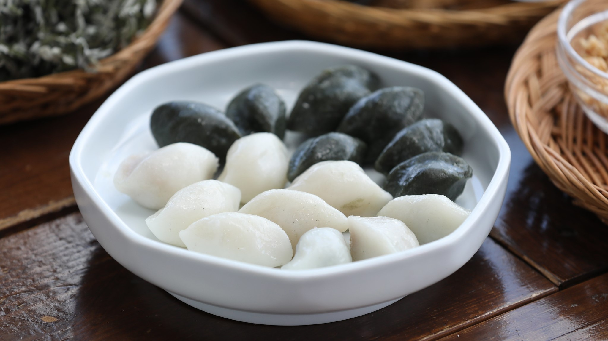

Republic of Korea - Flickr

<h2 class="blog-header--2" id="songpyeon">Songpyeon 송편</h2> 

Songpyeon is Chuseok’s iconic food - a small, crescent-shaped, often colorful, rice cake that contains red beans, chestnuts, jujubes, powdered sesame, or even just brown sugar. Traditionally, families would gather round and make songpyeon, but these days you can buy them at the market. 

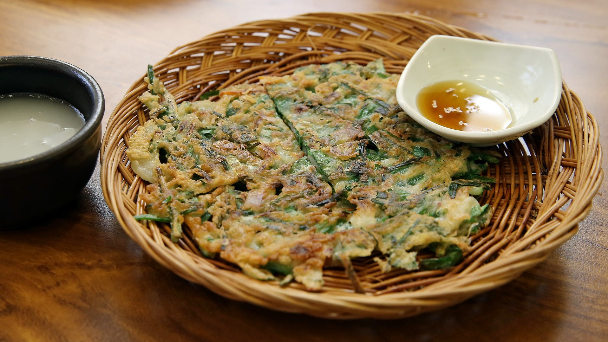

Republic of Korea - Flickr

<h2 class="blog-header--2" id="jeon">Jeon 전</h2> 

These are savory pan-fried pancakes using either a flour batter or an egg batter, with lots of variety - from pa-jeon (scallions), buchu-jeon (garlic chives), gamja-jeon (potatoes), kimchi-jeon (kimchi), or really anything. The beauty of jeon is it can make it whatever you want! 

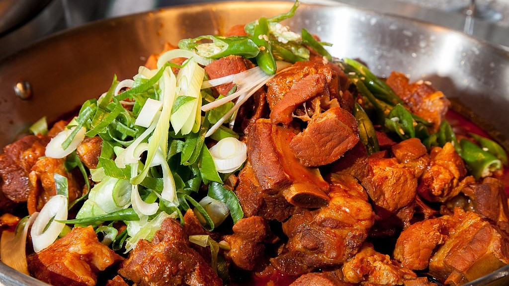

Commons - Wikipedia

<h2 class="blog-header--2" id="galbijjim">Galbijjim 갈비찜</h2> 

“Galbi” is beef short ribs and “Jjim” refers to steaming or boiling. In this case, galbi jjim is braised beef short ribs. It’s a sweet and savory dish that takes at least a couple of hours to cook so that the meat becomes tender and juicy. 

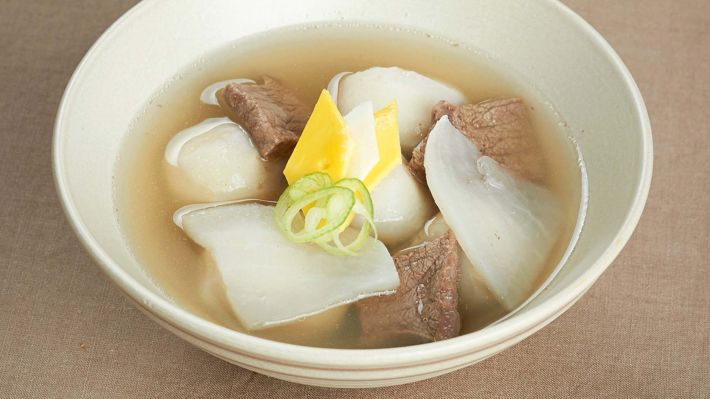

National Encyclopedia of Korea

<h2 class="blog-header--2" id="toranguk">Toranguk 토란국</h2> 

A delicious soup made from taro, a root vegetable similar to a potato but much sweeter, nuttier, and creamier. It’s a good source of vitamins, minerals, and protein. Taro is in peak season during Autumn, so this is a perfect time to cook up some toranguk. Word of caution: don’t overcook the toran (taro) or else it’ll melt into the soup!

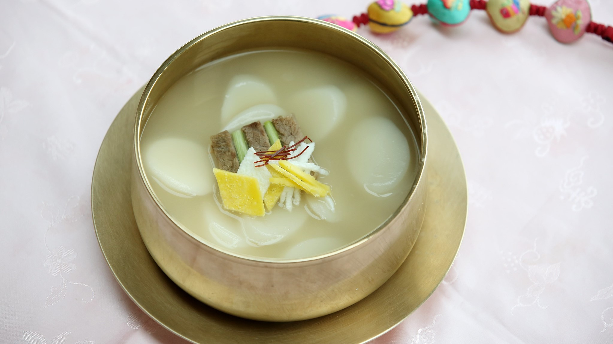

Republic of Korea - Flickr

<h2 class="blog-header--2" id="toranguk">Tteokguk 떡국</h2> 

A soup made with sliced rice cakes and a meat broth, usually beef. Tteokguk is often eaten in celebration of New Year’s, but is also served during Chuseok.

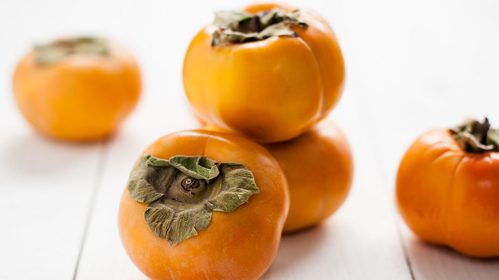

Eliza Adam - Flickr

<h2 class="blog-header--2" id="fruits">Fruits 과일</h2> 

Delicious fruits are in abundance during this season; it is a harvest festival, after all. You’ll find the more traditional fruits like Korean pears, apples, jujubes, persimmons, and dried fruit all around. Just a note, fruit can become much more expensive during Chuseok (but they are high quality and generally more delicious than your average). 

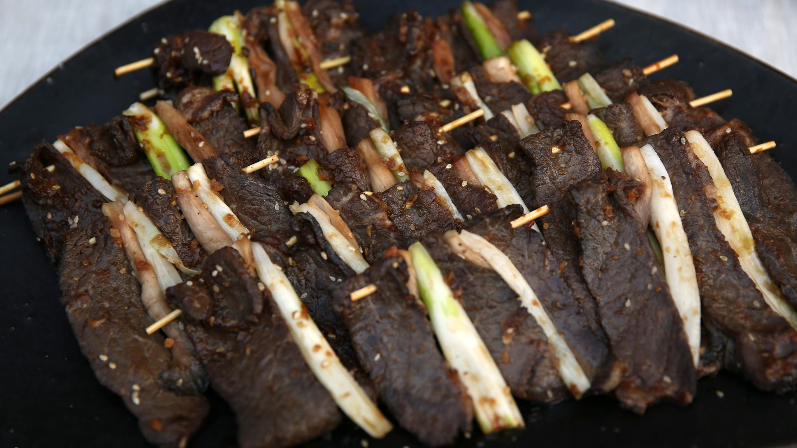

Republic of Korea

<h2 class="blog-header--2" id="sanjeok">Sanjeok 산적</h2> 

“Jeok” refers to skewered meats and vegetables that are grilled or pan-fried. Jeok dishes are often dredged with flour and egg before frying, but not Sanjeok. Sanjeok is particularly made with beef and the varieties are countless. Beef and fish cakes (eo-sanjeok), beef and mussels (honghap-sanjeok), beef and squid (ojingeo-sanjeok), beef and scallions (pa-sanjeok), beef and pine mushrooms (songi-sanjeok), etc, etc, etc...

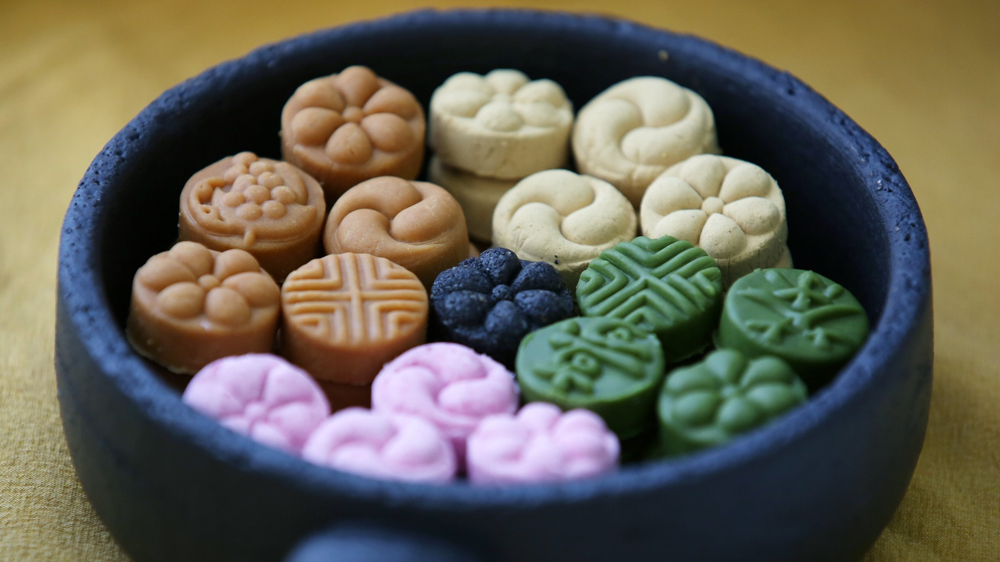

Republic of Korea - Flickr

<h2 class="blog-header--2" id="hangwa">Hangwa 한과</h2> 

Hangwa are confections that you can find in coffee shops, weddings, Charye tables, really anywhere. “Han” means Korean, while “gwa” means confection. There are eight different kinds of hangwa - dasik (“다식” accompanied with tea), gwapyeon (“과편” fruit jelly), jeonggwa (“정과” candied fruits), suksilgwa (“숙실과” sweeted and cooked fruit), yeotgangjeong (“엿강정” candy bar made of nuts or beans), yugwa (“유과” deep-fried glutinous rice puffs coated with honey and nuts), yumilgwa (“유밀과” honey cookies), and various candies like dang (“당” hard, sweet candies) or yeot (“엿” taffies).

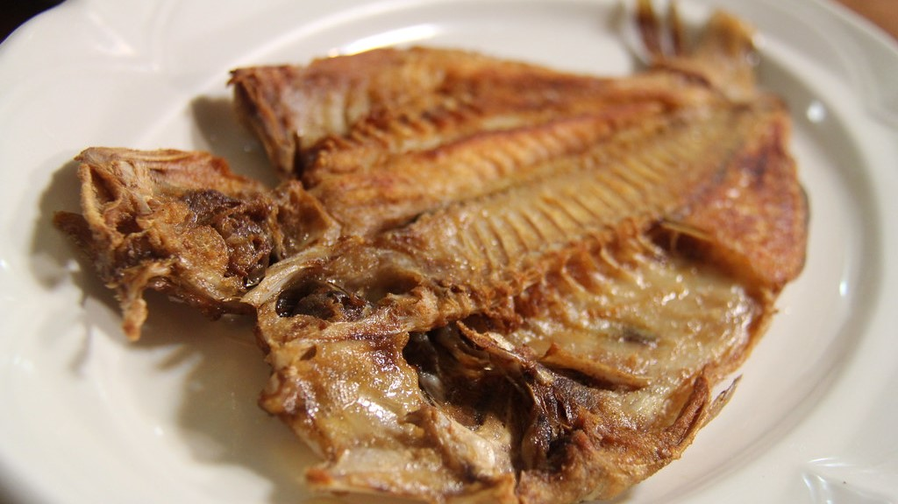

Republic of Korea - Flickr

<h2 class="blog-header--2" id="saengseontwigim">Saengseontwigim 생선튀김</h2> 

Basically, fried fish. Typically, jogi will be cooked for Chuseok. Jogi are yellow croaker fish that have been gutted, dried, and salted. They’re often used in soups, stews, steamed dishes, or pan-fried without any additional seasonings. 

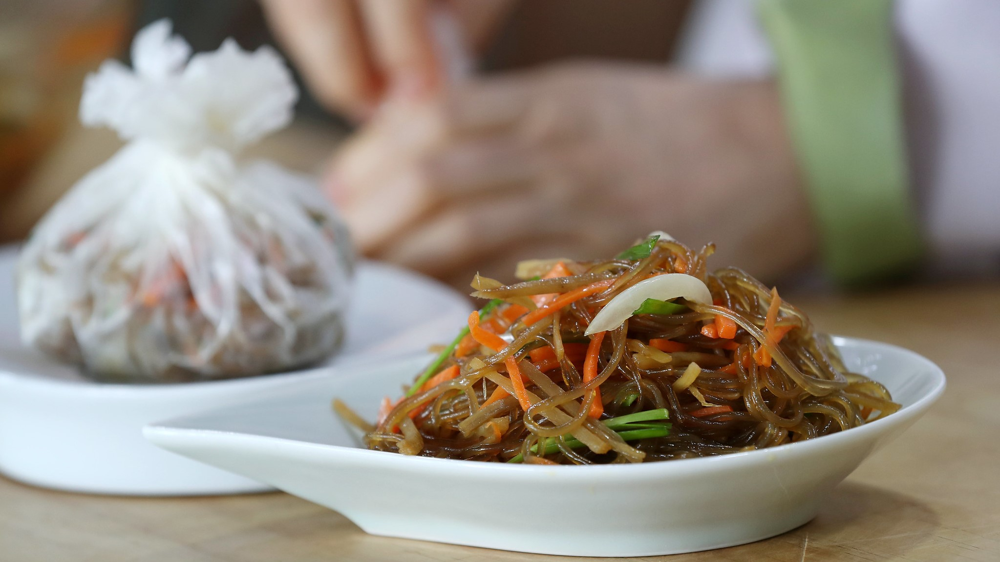

Republic of Korea - Flickr

<h2 class="blog-header--2" id="japchae">Japchae 잡채</h2> 

Japchae is a stir-fry dish using noodles made from sweet potato starch, otherwise known as “glass noodles” or dangmyeon (당면), topped with meat and vegetables and seasoned with soy sauce and sesame oil. You’ll see it sometimes as a side dish or an entree. 

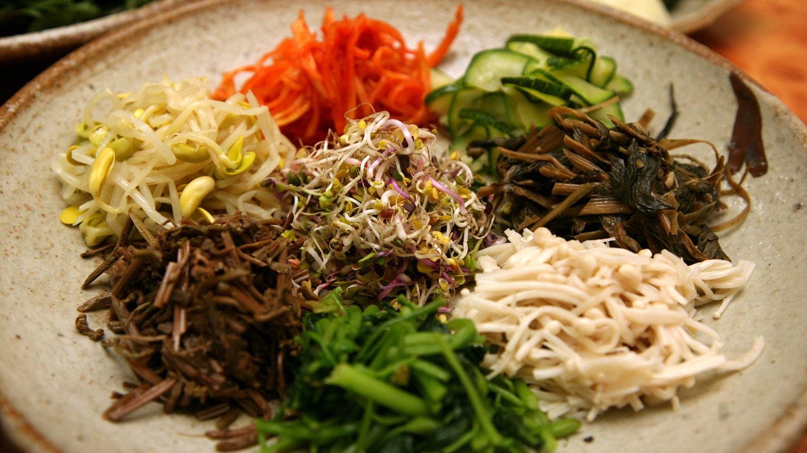

Republic of Korea - Flickr

<h2 class="blog-header--2" id="namul">Namul 나물</h2> 

Namul generally refers to a variety of side dishes, or banchan (반찬), made mainly with vegetables. There are many kinds of namul, such as chwi-namul (취나물), dot-namul (돋나물), doraji-namul (도라지 나물), sukju-namul (숙주나물), and sigeumchi-namul (시금치 나물). Any type of vegetable, herb, or greens, can work as namul and they’re often mixed with other meats or vegetables.

