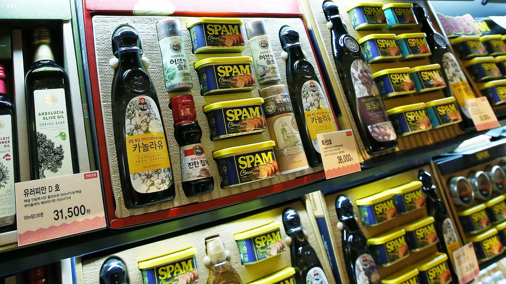

Although many stores are closed on the day of Chuseok, there are usually a myriad of sales the day before. Department stores, grocery stores, and everything in between probably have Chuseok gift sets (추석선물세트) for sale. Gift sets are ubiquitous during the biggest holidays, with this being a very busy time for shopping. Because Chuseok is a harvest festival, traditional gift items were harvested foods.

Today, gift sets are usually sold with items as traditional as fruits or ginseng, to diverse sets including shampoo, soap, or even spam. If you’re not in Korea, check out your local Asian supermarket to see if there are any special foods for sale during this time - the harvest festival isn’t just limited to Korea! 

Republic of Korea - Flickr

<h2 class="blog-header--2">Fun Fact</h2>

Recently, an anti-corruption law has been passed to limit the prices of Chuseok gift sets to prevent bribery and limit the amount of money those in civil service, media, or education can spend and receive. This act states a ₩30,000 limit on meals, ₩50,000 on gifts, and ₩100,000 on cash that public officials can accept at closed events. 

    <h3 class="blog-link__header">Learn more</h3>
    

        
<u><b><a href="https://snackfever.com/blogs/magazine/your-chuseok-gift-giving-guide" target="_blank" rel="noopener noreferrer">Your Chuseok Gift-Giving Guide</a></b></u> - SnackFever

        
<u><b><a href="https://hauteculturefashion.com/where-to-rent-and-buy-a-hanbok-in-seoul/" target="_blank" rel="noopener noreferrer">Chuseok Gift Sets Now More Affordable Than Ever</a></b></u> - Korea Joongang Daily

    

