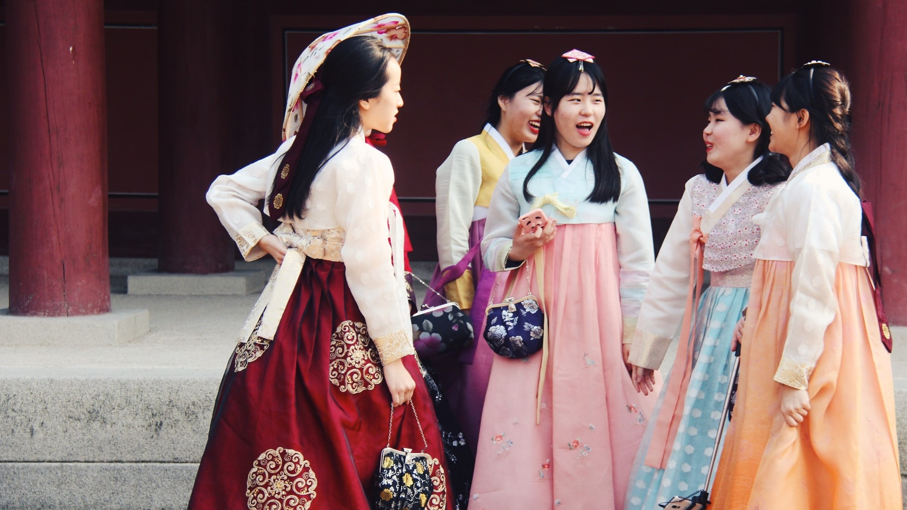
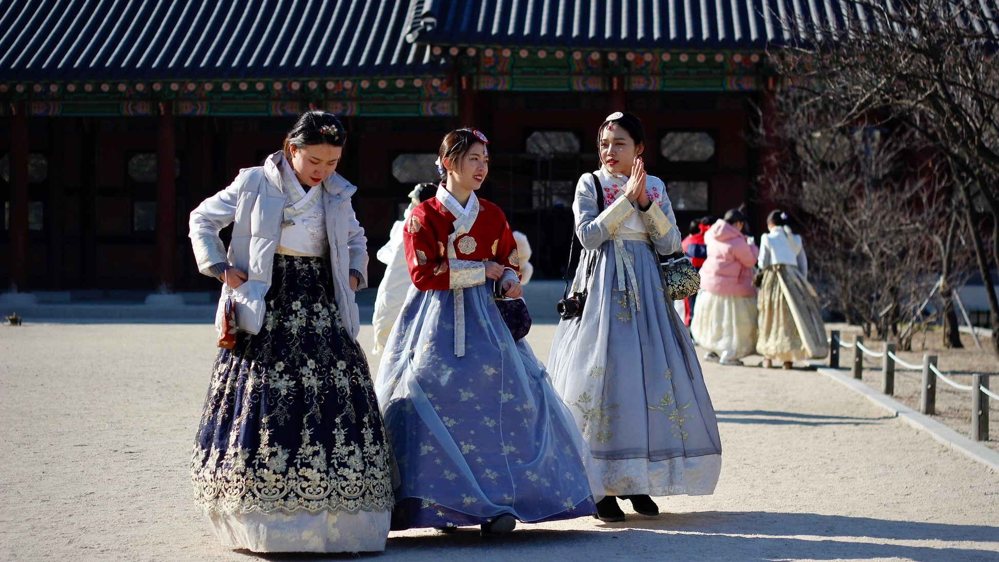

Hanbok (한복) are distinctly colorful, elegant, and expressive clothes that have been around for over 1,600 years. They have evolved a little over time and remain a symbol of the country’s traditional culture and lifestyle. Hanbok are important to Korea’s cultural identity. Its evolution, expression, variations, and details form the outfit representative of Korea.

<h2 class="blog-header--2 mt-5">Historically</h2>

Hanbok, or Joseonot (조선옷) in North Korea, were worn daily up until the 21st century. They literally mean ‘Korean clothing’, but now refer to the particular style worn in the Joseon era (14th-19th century). This is because the hanbok evolved the most during this time, into what we see now. The materials and colors reflected social status - brighter colors and more expensive materials were reserved for royalty and the elite, while paler colors and cheaper materials were for the common class.

Today, hanbok are not usually worn outside of special occasions, like weddings or Chuseok. Still, many people feel like hanbok are too traditional and cumbersome to be worn during modern events. Because of this, most people will rent hanbok when they need to, but it’s becoming less often that happens. There are many efforts to encourage wearing hanbok. 

Pauline Mae De Leon - Unsplash

<h2 class="blog-header--2">Fun fact</h2>

In modern times, a Hanbok can be considered a type of bim (빔). Bim refers to clothing that is worn on special occasions in Korea. There are two types that are typically referred to - Seolbim(설빔) and Chuseokbim (추석빔). They each mean clothes that are worn for Seollal and Chuseok respectively. In each case, a Hanbok is the occasional attire. 

The contemporary take on hanbok can be seen in fashion shows, especially on Hanbok Day (October 21). Designers take the traditional attire and make stylish variations that fit a modern look.

    <h3 class="blog-link__header">Learn more</h3>
    

        
<u><b><a href="https://www.youtube.com/watch?v=jue7fPFEq-0" target="_blank" rel="noopener noreferrer">Royal Hanbok - What Korean Kings and Queens Used to Wear (왕과 왕비가 입었던 한복)</a></b></u> - Talk to Me in Korean

        
<u><b><a href="https://hauteculturefashion.com/where-to-rent-and-buy-a-hanbok-in-seoul/" target="_blank" rel="noopener noreferrer">The Handsome Hanbok and Where to Buy One in Seoul</a></b></u> - Haute Culture Fashion

        
<u><b><a href="https://www.elle.com/fashion/a23315975/the-hanboks-tale-crystal-hana-kim/" target="_blank" rel="noopener noreferrer">Why I Wear My Hanbok</a></b></u> - Elle Magazine

    

Kseniya Petukhova - Unsplash

<h2 class="blog-header--2">Wearing one</h2>

For women, an underskirt is typically worn underneath the visible skirt which is called chima (치마). For men, this is called a baji (바지). Once wrapped, the end of the skirt should be placed on a woman’s left side so that she can move and sit down easily. Modern chimas have shoulder straps, however traditionally the malgi (upper part) of the skirt would be wrapped tightly around a woman’s chest. For both male and female, the jeogori (저고리) is worn on top with a ribbon on the chest. There are many hats to wear and hair accessories that can be used to tie up hair into a bun like a binyeo (비녀). The main difference between male and female hanbok is that females have more intricate patterns, seams, and cloth while men have simpler components and often wear an overcoat called po.

<h2 class="blog-header--2 mt-5">Variety</h2>

Aside from the traditional elite and commoner variations, there are also hanbok for weddings, children, and funerals. Weddings are where you may see them the most. Traditionally, there were hanbok specifically for the king, the queen, the princess, and the prince for formal ceremonies and daily wear. 

