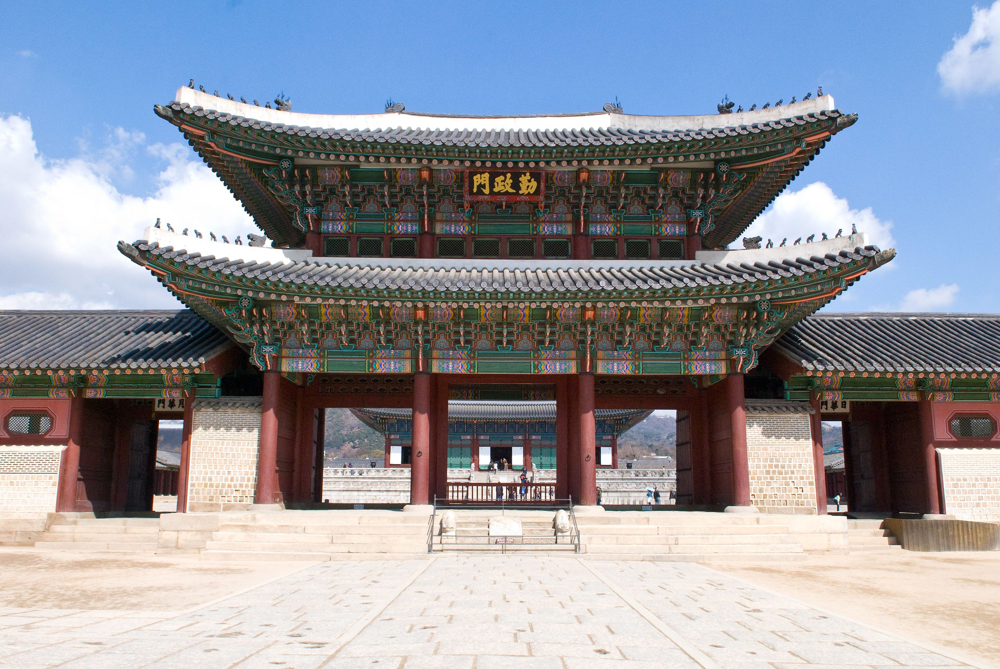
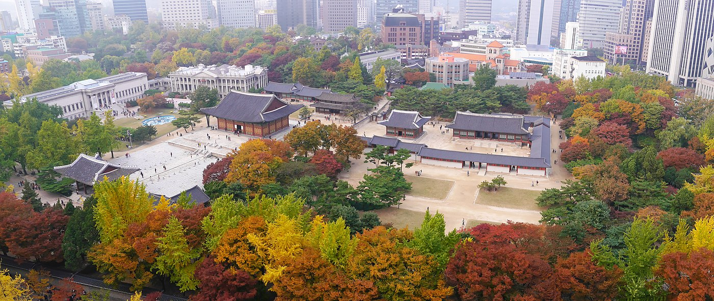
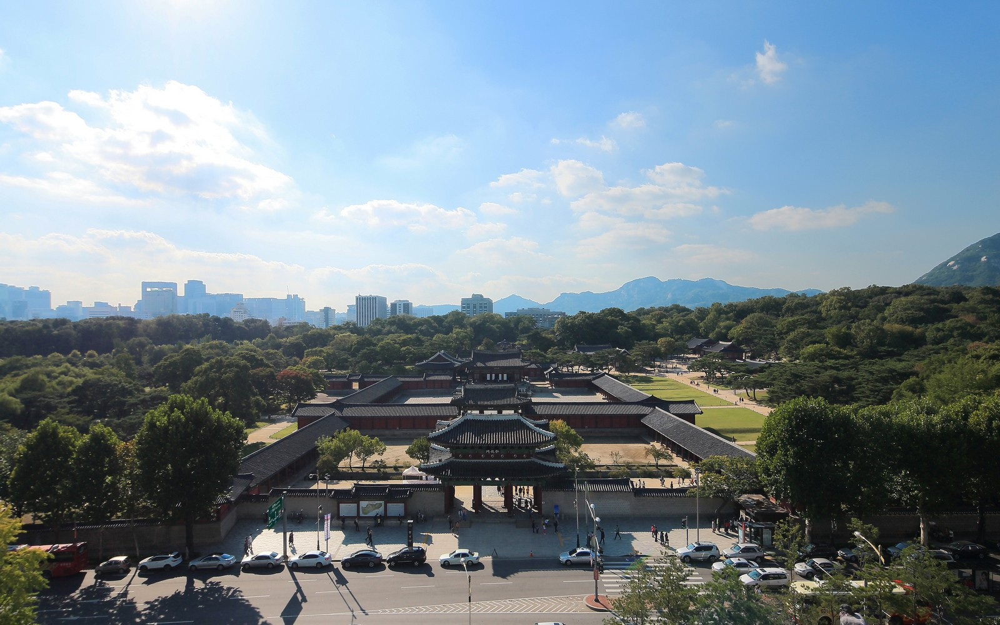
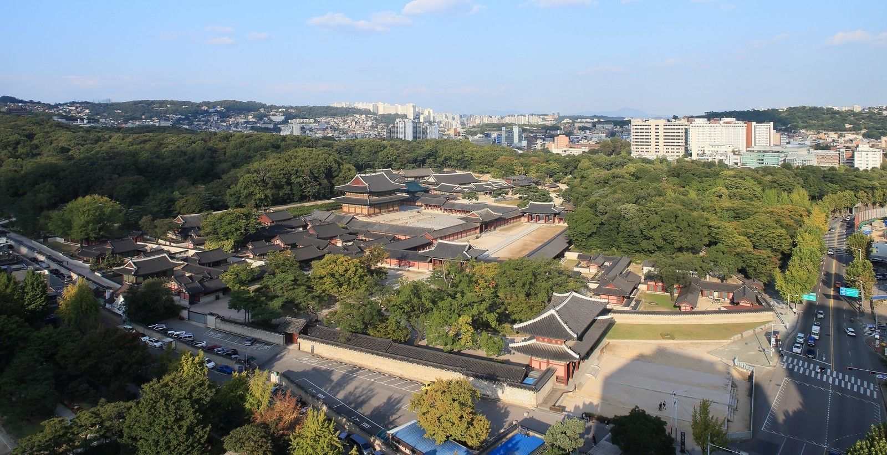
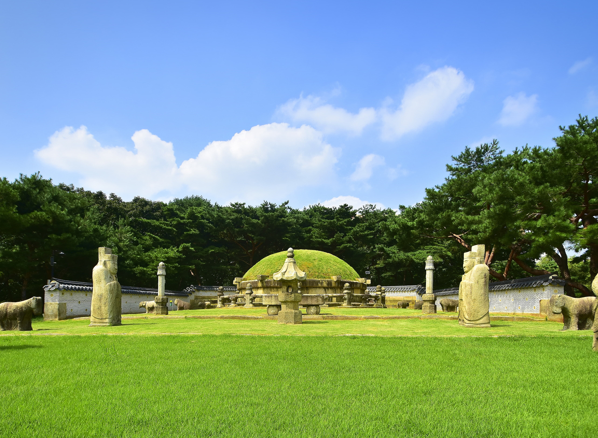
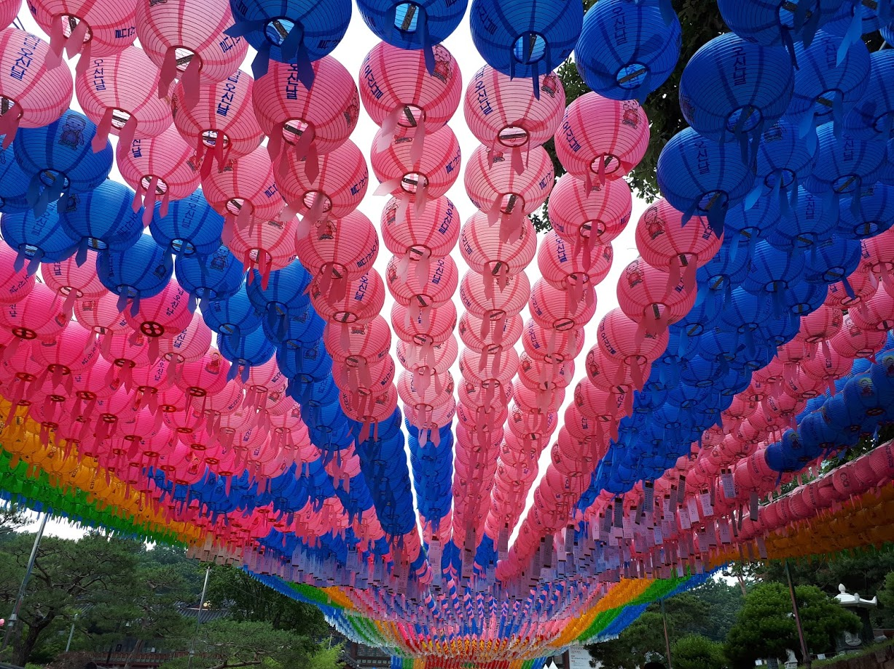
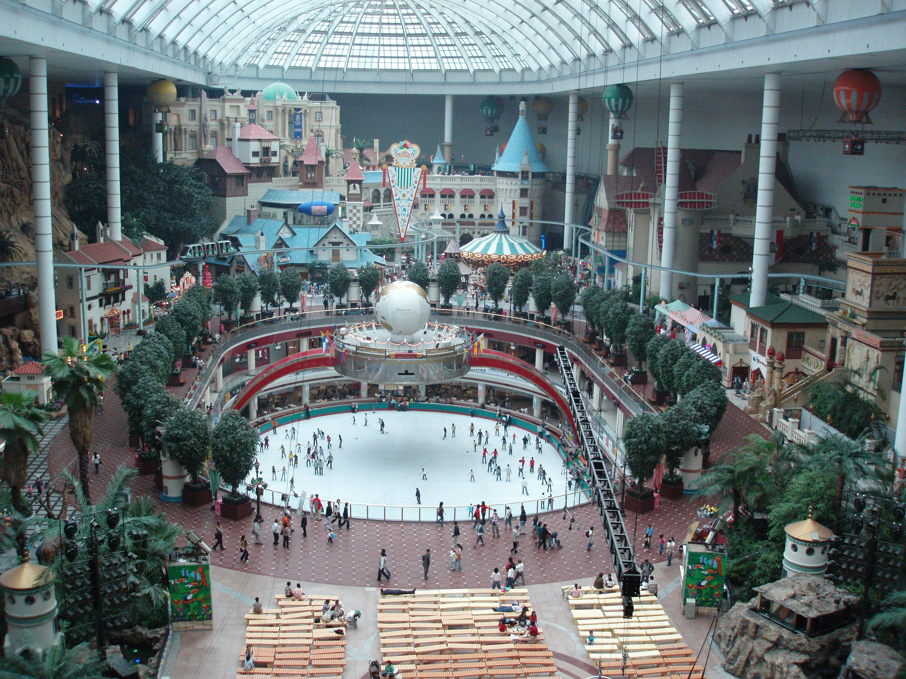
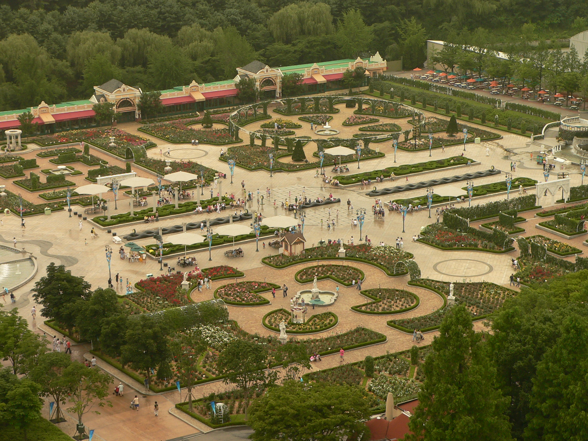
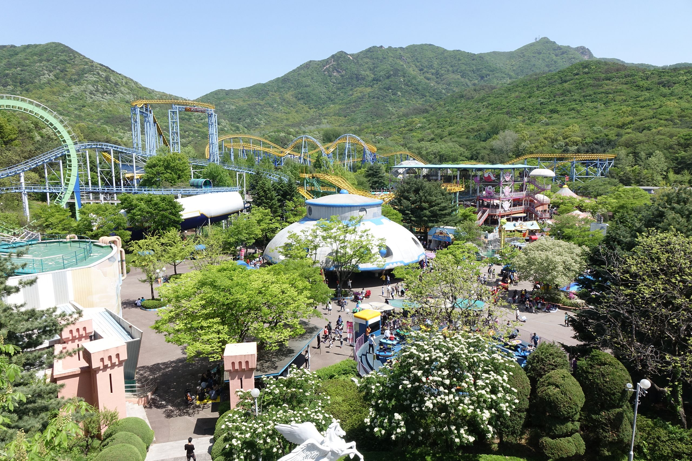

Commons - Wikipedia

<h2 class="blog-header--2"><a href="http://english.visitkorea.or.kr/enu/ATR/SI_EN_3_1_1_1.jsp?cid=264337">Gyeongbeokgung 경복궁</a></h2>

Located in Seoul, this <i>"was the main royal palace of the Joseon dynasty. Built in 1395, it is located in northern Seoul, South Korea. The largest of the Five Grand Palaces built by the Joseon dynasty, Gyeongbokgung served as the home of Kings of the Joseon dynasty, the Kings' households, as well as the government of Joseon."</i> - Wikipedia

Commons - Wikipedia

<h2 class="blog-header--2"><a href="https://english.visitkorea.or.kr/enu/ATR/SI_EN_3_1_1_1.jsp?cid=264316">Deoksugung Palace 덕수궁</a></h2>

Located in Seoul, <i>"Deoksugung Palace is special among Korean palaces. It has a modern and a western style garden and fountain. The Changing of the Royal Guard, in front of Daehanmun (Gate), is a very popular event for many visitors. The royal guard was responsible for opening and closing the palace gate during the Joseon Dynasty. Outside of the palace is a picturesque road with a stone wall."</i> - Wikipedia

Commons - Wikipedia

<h2 class="blog-header--2"><a href="https://english.visitkorea.or.kr/enu/ATR/SI_EN_3_1_1_1.jsp?cid=264316">Changgyeonggung Palace 창경궁</a></h2>

Located in Seoul, Changgyeonggung palace <i>"was built in the mid-15th century by King Sejong for his father, Taejong. It was originally named "Suganggung," but it was renovated and enlarged in 1483 by King Seongjong, at which time it received its current name. Many structures were destroyed during Japan's multiple late 16th century attempts to conquer Korea and invade China. It was rebuilt by successive Joseon Kings but was once again largely destroyed by the Japanese in the early 20th century, but this time torn down methodically to make room for a modern park, a showplace for the empire, akin to Tokyo's Ueno Park."</i> - Wikipedia

Commons - Wikipedia

<h2 class="blog-header--2"><a href="https://english.visitkorea.or.kr/enu/ATR/SI_EN_3_1_1_1.jsp?cid=264348">Changdeokgung Palace 창덕궁</a></h2>

Located in Seoul, <i>"Changdeokgung was the most favored palace of many Joseon princes and retained many elements dating from the Three Kingdoms of Korea period that were not incorporated in the more contemporary Gyeongbokgung. One such element is the fact that the buildings of Changdeokgung blend with the natural topography of the site instead of imposing themselves upon it."</i> - Wikipedia

Visit Seoul

<h2 class="blog-header--2"><a href="http://english.visitkorea.or.kr/enu/ATR/SI_EN_3_1_1_1.jsp?cid=264106">Seonjeongneung Royal Tombs 선정릉</a></h2>

Located in Seoul, <i>"Seonjeongneung is the name of Seolleung and Jeongneung combined, and it refers to the royal tombs of King Seongjong (the 9th king of the Joseon Dynasty), Queen Jeonghyeon (the second wife of King Seongjong) and King Jungjong (a son of the two). Seonjeongneung was designated as a UNESCO World Heritage site in 2009, enhancing its status as historic remains."</i> - Visit Seoul

Commons - Wikipedia

<h2 class="blog-header--2"><a href="https://english.visitkorea.or.kr/enu/ATR/SI_EN_3_1_1_1.jsp?cid=264594">Bongeunsa Temple 봉은사</a></h2>

Located in Seoul, <i>"The temple is a notable tourist destination, offering a Temple Stay program in which visitors can experience the life of a monk. Participants can experience various traditions linked with the temple's history. They can experience baru gongyang (Korean: 발우 공양; Hanja: 鉢盂供養), a Buddhist temple meal using a baru (Korean: 발우; Hanja: 鉢盂), which is a rice bowl used by monks."</i> - Wikipedia

Commons - Wikipedia

<h2 class="blog-header--2"><a href="http://adventure.lotteworld.com">Lotte World 롯데월드 어드벤처</a></h2>

Located in Seoul, <i>"Lotte World is a major recreation complex in Seoul, South Korea. It consists of the world's largest indoor theme park, an outdoor amusement park called "Magic Island", an artificial island inside a lake linked by monorail, shopping malls, a luxury hotel, a Korean folk museum, sports facilities, and movie theaters."</i> - Wikipedia

Commons - Wikipedia

<h2 class="blog-header--2"><a href="https://www.everland.com/web/multi/english/everland/main.html?m">Everland 에버랜드</a></h2>

Located in Yongin, <i>"Everland is South Korea's largest theme park. Located at the Everland Resort in Yongin, a city in Gyeonggi-do, it receives 5,85 million visitors annually and was ranked nineteenth in the world for amusement park attendance in 2018. As of 2010, Everland is measured to be approximately 1,200,000 yards in size. Along with its main attractions, Everland includes a zoo and water park known as Caribbean Bay."</i> - Wikipedia

Commons - Wikipedia

<h2 class="blog-header--2"><a href="http://eng.seoulland.co.kr/eng/index.asp">Seoul Land 서울랜드</a></h2>

Located in Gwacheon, <i>"It is located in the Seoul Grand Park complex. It opened just before the 1988 Summer Olympics. It has about 40 rides, including roller coasters, and movie theaters. Seasonal festivals are held in the park. It is smaller than Everland, but closer to Seoul, about one hour away from downtown. Approximately 3–3.5 million people visit the park in a year. Roughly a third of its 300,000 m2 is green space, the rest being packed with the attractions."</i> - Wikipedia

