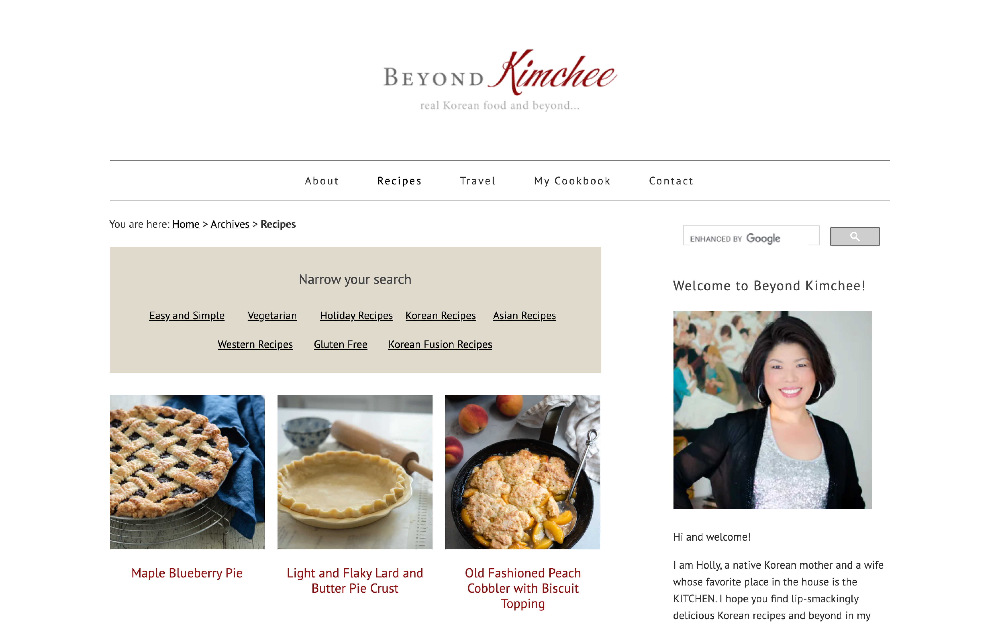
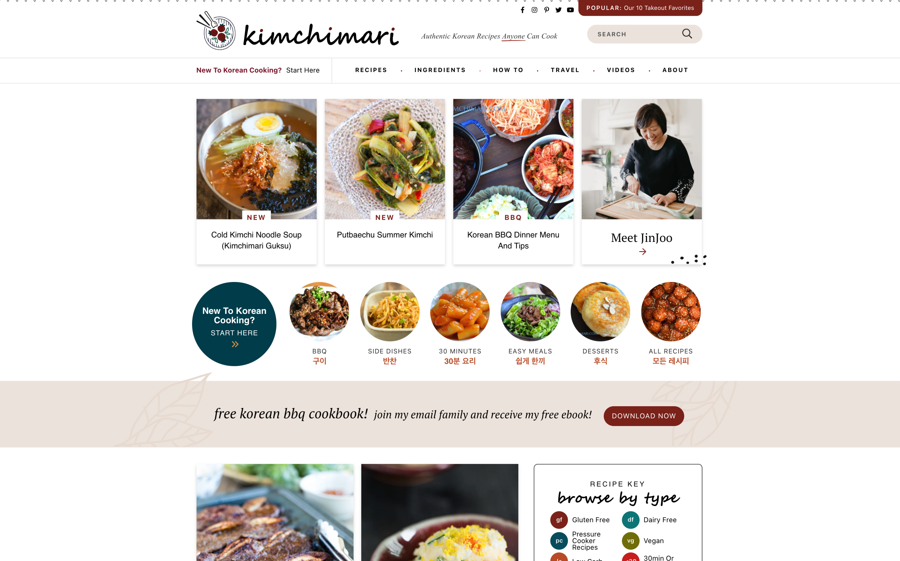
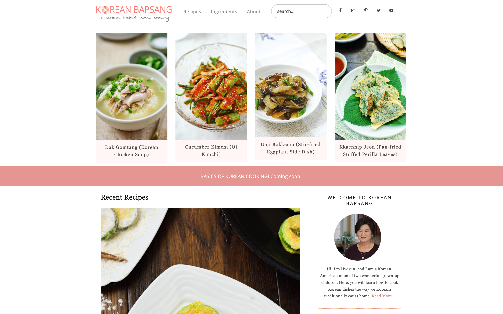
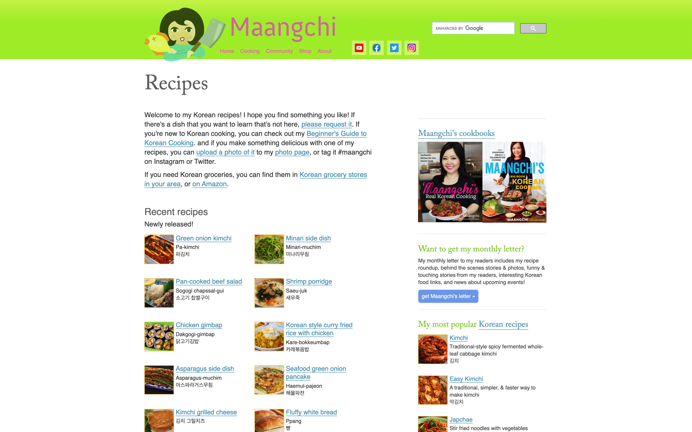

  <a href="http://www.beyondkimchee.com" onClick="window.location.reload();" class="fest-image">
      
      <h3 class="landing-header__two mt-4">Beyond Kimchee</h3>
      
"Real Korean food and beyond."

  </a>
  <a href="https://kimchimari.com/" onClick="window.location.reload();" class="fest-image fest-image--second">
      
      <h3 class="landing-header__two mt-4">Kimchimari</h3>
      
"Authentic Korean recipes."

  </a>
  <a href="https://www.koreanbapsang.com" onClick="window.location.reload();" class="fest-image fest-image--second">
      
      <h3 class="landing-header__two mt-4">Korean Bapsang</h3>
      
"A Korean mom's home cooking."

  </a>
  <a href="https://www.maangchi.com" onClick="window.location.reload();" class="fest-image fest-image--second">
      
      <h3 class="landing-header__two mt-4">Maangchi</h3>
      
"Cooking Korean food with Maangchi."

  </a>
  <a href="https://mykoreankitchen.com" onClick="window.location.reload();" class="fest-image fest-image--second">
      
      <h3 class="landing-header__two mt-4">My Korean Kitchen</h3>
      
"Easy Korean recipes."

  </a>

