

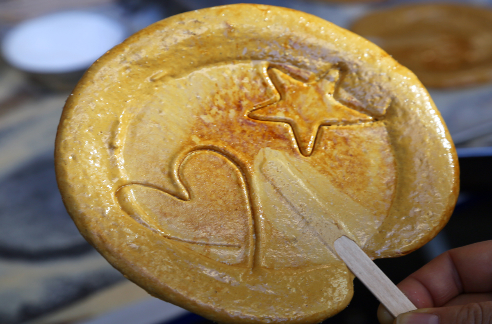

Maangchi

<h2 class="blog-header--2">Dalgona/Ppopgi 뽑기 (toffee candy)</h2>

An old-school candy that is typically sold at street vendors. It is made by heating sugar and baking soda while stirring. Traditionally, a cookie-cutter will be used to imprint different shapes or patterns on each candy and some vendors will make a game out of it - use a stick and to carve out the pattern in one piece and you’ll get the candy for free!

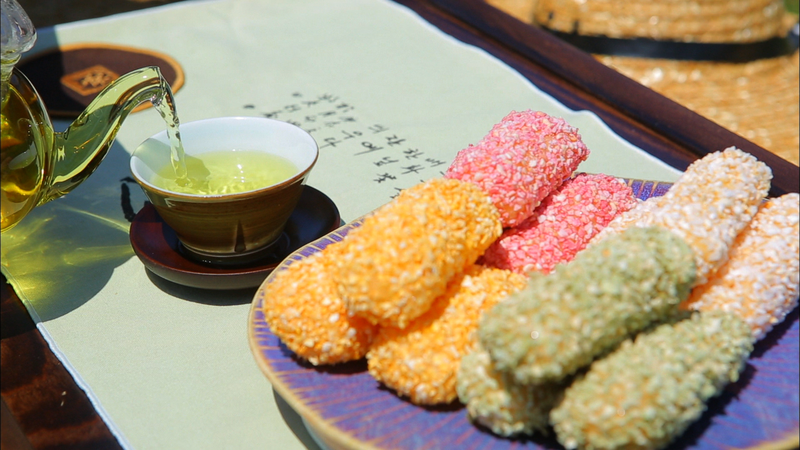

Commons - Wikipedia

<h2 class="blog-header--2">Gangjeong 강정 (sweet rice puff)</h2>

A sweet rice puff that comes in different colors, flavors, and is similar to a rice krispie treat. A thick syrup is used to keep all the rice bits together and it is often mixed with all sorts of dried fruit, nuts, and seeds.

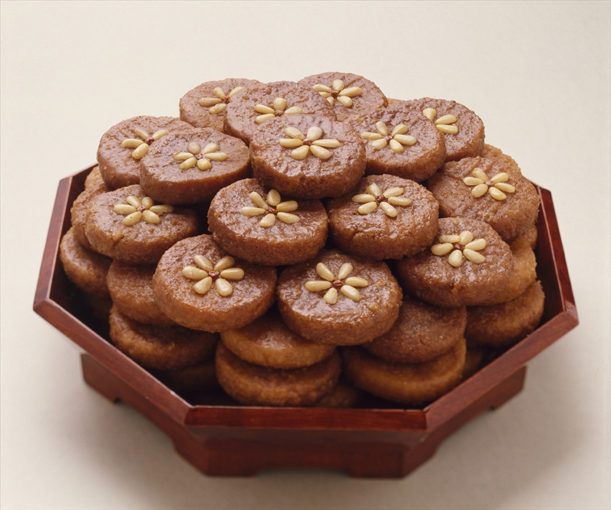

Commons - Wikipedia

<h2 class="blog-header--2">Yakgwa 약과 (honey cookies)</h2>

These are deep-fried snacks that come in the shape of flowers. The first part, "yak", means medicine, while the second part, "gwa," means sweet. It is made primarily with honey and flour, often with ginger and sesame oil added to it. These cookies are traditionally eaten during holidays and celebrations such as Chuseok and weddings.

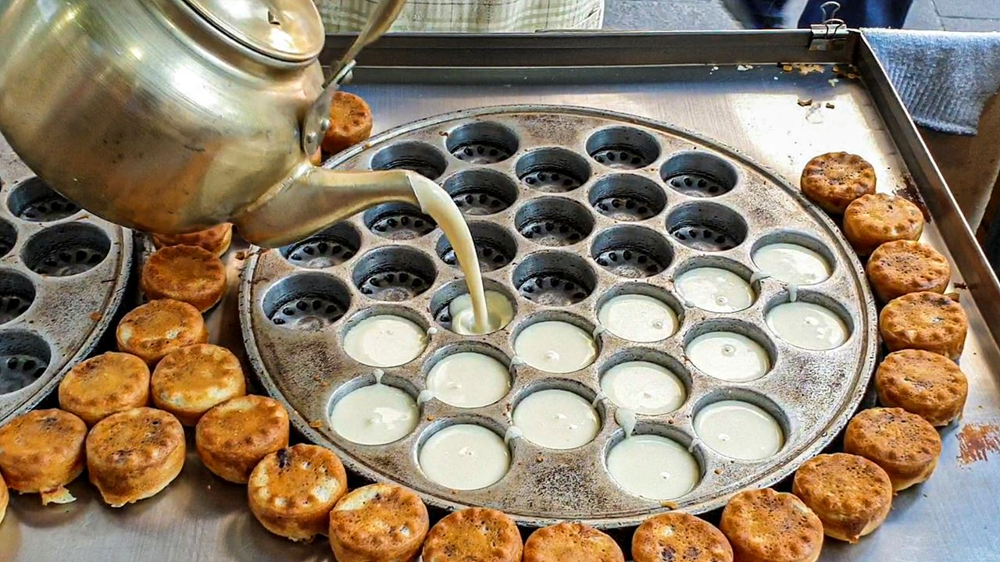

Mayo Korea

<h2 class="blog-header--2">Gukhwappang 국화빵 (chrysanthemum bread)</h2>

Another flower-shaped pastry that has a more bread-like texture and flavor. It typically has red bean paste as a filling. You can usually find these sold at stalls on the street.

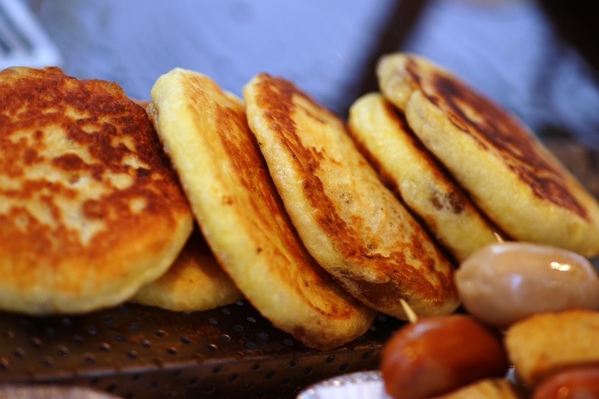

Commons - Wikipedia

<h2 class="blog-header--2">Hotteok 호떡 (Korean sweet pancakes)</h2>

This is a Korean pancake more on the sweet side. They are typically stuffed with cinnamon, brown sugar, nuts, and seeds.

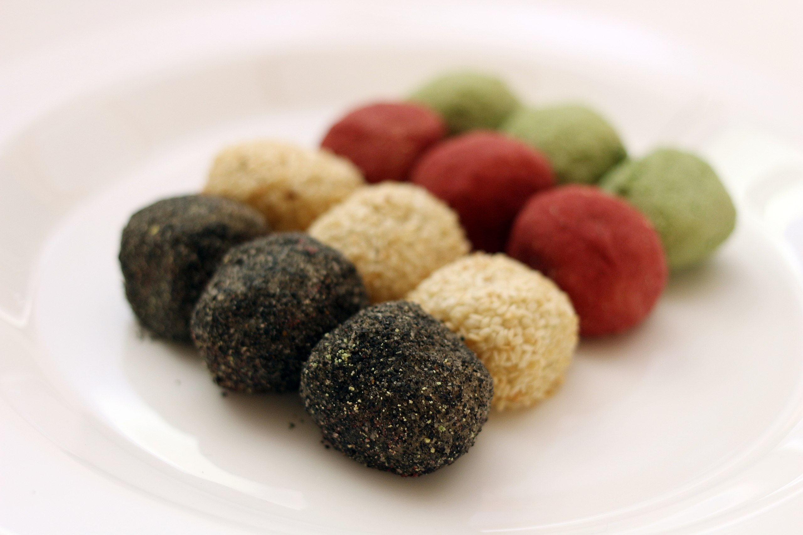

Commons - Wikipedia

<h2 class="blog-header--2">Gyeongdan 경단 (sweet rice balls)</h2>

These rice balls are very similar to the Japanese dango and have a chewy consistency. They come in different flavors that coat the exterior like sweet potato, green tea, or black sesame.

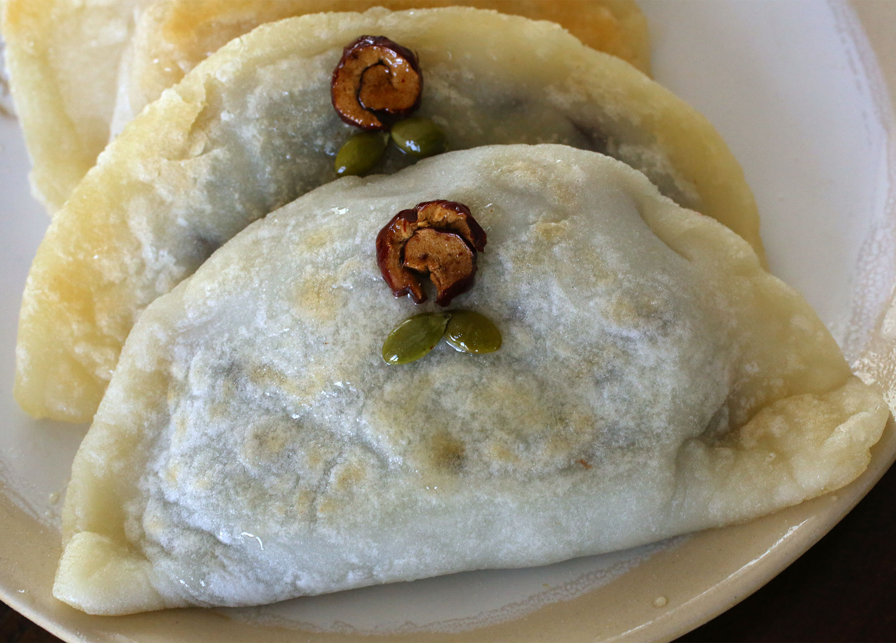

Commons - Wikipedia

<h2 class="blog-header--2">Bukkumi 부꾸미 (sorghum pancakes)</h2>

This is a pancake made using sorghum flour and typically is filled with red bean paste. It is known as a healthy food and is typically enjoyed in the winter months. Because the sorghum has an earthy flavor, the red bean paste balances it out with some sweetness.

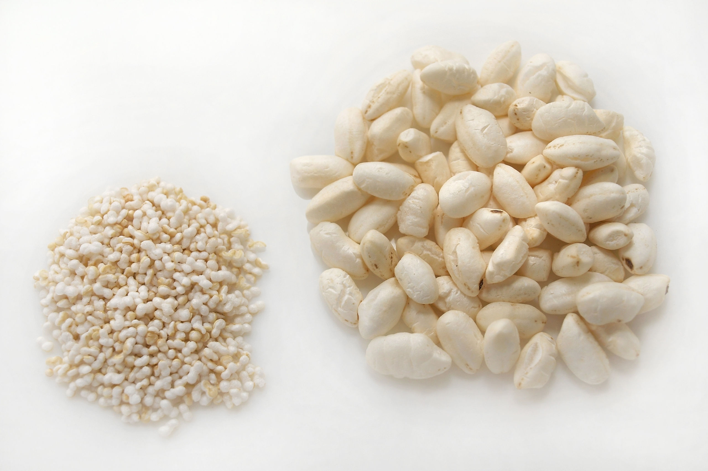

Commons - Wikipedia

<h2 class="blog-header--2">Ppeongtwigi 뻥튀기 (Korean popcorn)</h2>

These are plain rice crackers that dissolve easily and can be enjoyed alongside other things, like ice cream, peanut butter, or even cream cheese. You can pair these with a lot of things!

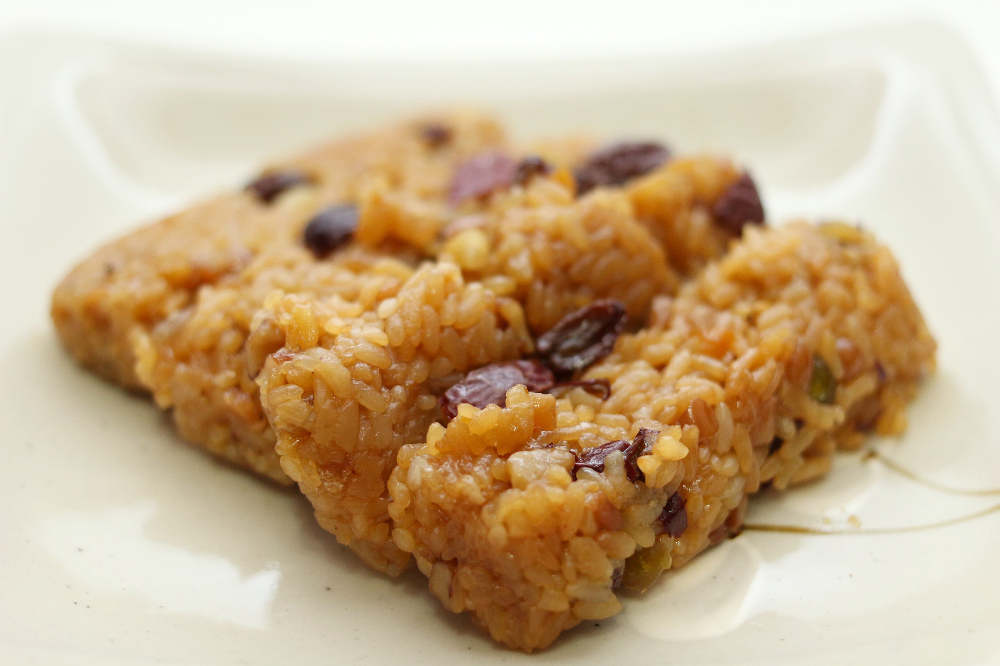

Commons - Wikipedia

<h2 class="blog-header--2">Yaksik 약식 (sweet glutinous rice)</h2>

These are bars made using sweet glutinous rice and a variety of nutritious ingredients, such as chestnuts, jujubes, and pine nuts. It is usually mixed with brown sugar, soy sauce, and sesame oil, so it has a brown appearance. Yaksik is traditionally enjoyed during Lunar New Year.

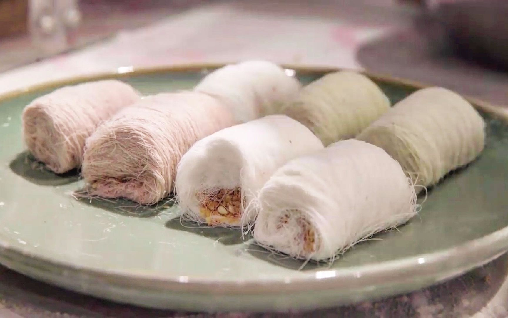

MadCuisine - Bilibili

<h2 class="blog-header--2">Kkultarae 약식 (dragon's beard candy)</h2>

Dragon’s beard candy is made by mixing honey and cornstarch, then stretching and pulling it until many thin strands are created. It is then wrapped around a stick and topped with nuts. You can find dragon’s beard candy along popular streets with food vendors and they often put on a show for you while making it!

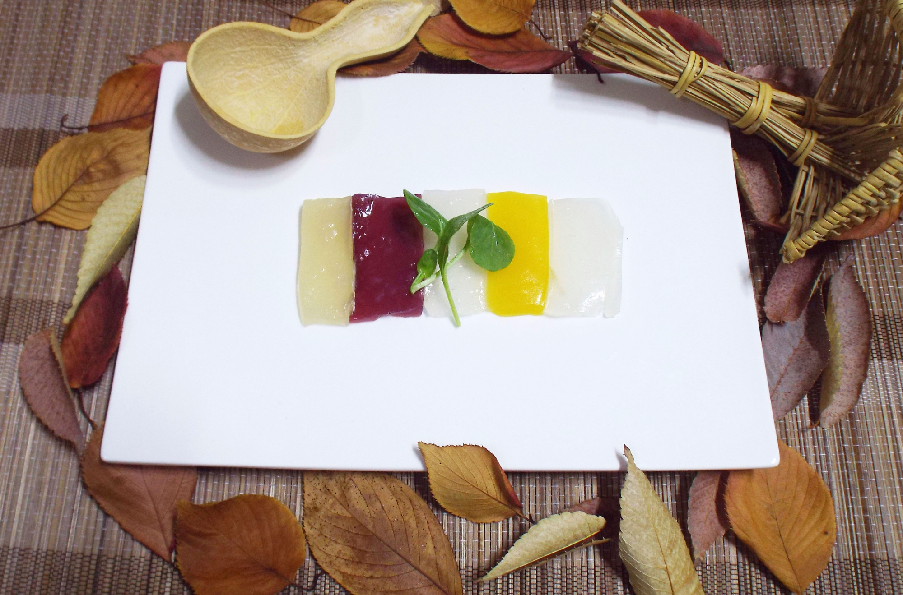

AwesomeKFOOD

<h2 class="blog-header--2">Gwapyeon 과편 (fruit cakes)</h2>

These are traditional fruit cakes made using agar, various fruits, and berries.

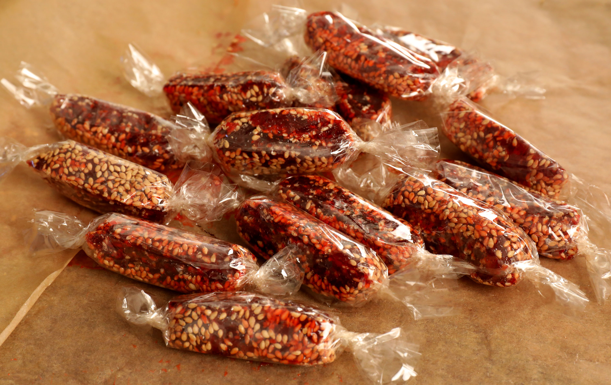

Maangchi

<h2 class="blog-header--2">Jeonggwa 정과 (fruit cakes)</h2>

Basically candied fruit/root made by boiling the sliced fruits/roots in honey or rice syrup.

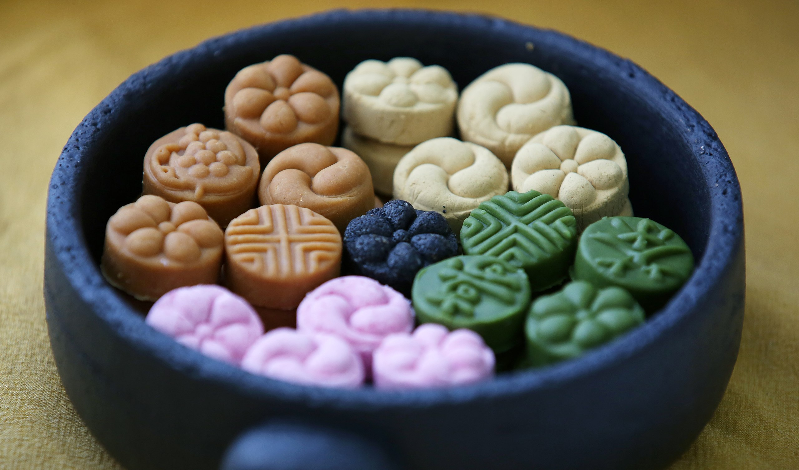

Commons - Wikipedia

<h2 class="blog-header--2">Dasik 다식 (fruit cakes)</h2>

These are bite-sized confectioneries that come in various colors, sizes, and often accompany tea.

