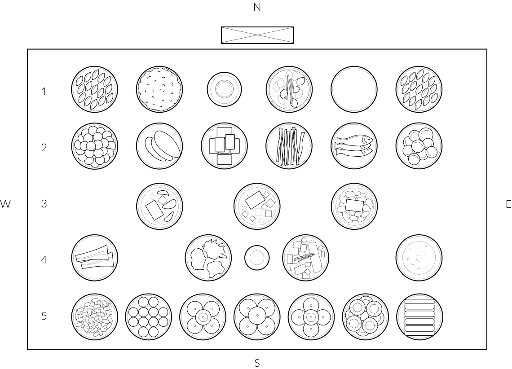

Traditionally, there are general guidelines to follow when setting up the table for charye (차례). The reason is similar to Feng Shui, but for the relationship between the ancestral offering and the ancestors. It differs slightly from house to house and from region to region. For example, a house in Busan may have much more fish on the table than a house from Seoul.

<h2 class="blog-header--2">Guidelines</h2> 

<h3 class="blog-header--3">1st row</h3>

Utensils, cups, and Ddeokguk 떡국 (rice cake soup).

<h3 class="blog-header--3">2nd row</h3>

From West to East: 
 Guksu 국수 noodles, Yukjeon 육전 meat pancakes, Sojeon 소전 beef pancakes, Eojeok 어적 fish, and Siluddeok시루떡 rice cake.
 
 
Eodongyuseo 어동유서 refers to placing fish on the east side and meat on west side, while Dongduseomi 동두서미 refers to placing the fish head oriented to the east and tail oriented to the west.

<h3 class="blog-header--3">3rd row</h3>

Meat soup, beef soup, and fish soup.

<h3 class="blog-header--3">4th row</h3>

Po 포 (jerky), Namul 나물 (seasoned vegetables), Ganjang 간장 (soy sauce), Nabak kimchi 나박김치 (kimchi), and Sikhye 식혜 (sweet drink).

Jwapo oohye 좌포우혜 refers to placing jerky on west side and sikhye on the east side.

<h3 class="blog-header--3">5th row</h3>

Fruits and desserts.
 

Hodongbaekseo 홓동백서 refers to white-colored foods placed on the east side while white-colored food goes on the west side. Joyoolissi 조율이시 is a term that refers to jujubes, chestnuts, pears, and dried persimmons.
