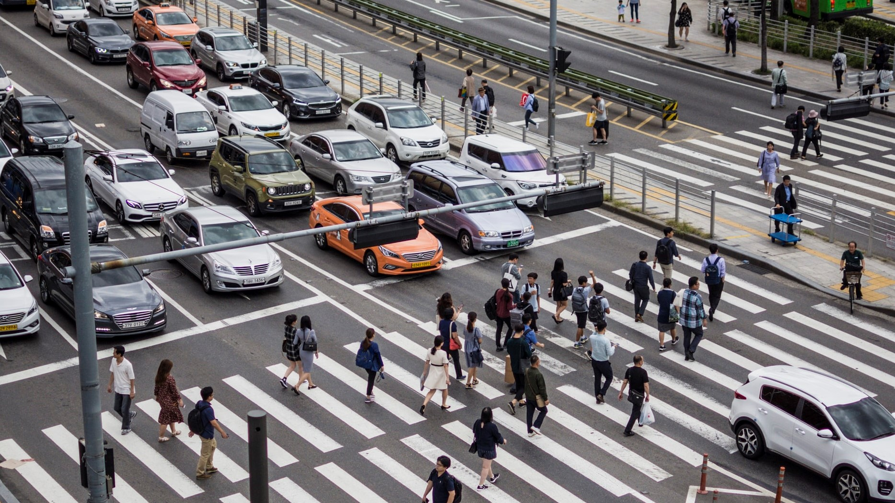
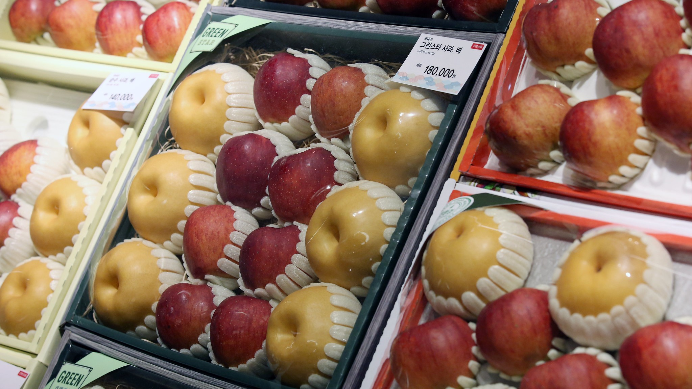
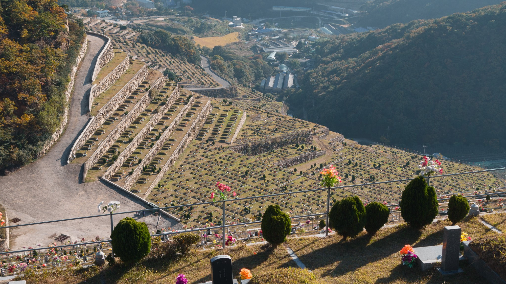

Chuseok occurs on the 15th day of the 8th month of the lunar calendar (usually around late September to early October) on the full moon - it lasts 3 days in total. Sometimes, like in 2017, the Chuseok days line up with National Foundation Day and Hangeul Day to make one long holiday break. It’s also known as Hangawi (the name, “Chuseok”, is derived from Chinese characters whereas Hangawi is more native. However, Hangawi is used mostly on media advertisements).

Jean Sabeth - Unsplash

<h2 class="blog-header--2">Lots of traffic</h2>

In Korea, you can expect an alarming amount of traffic the day before and the day after Chuseok. On the day before, people often commute to their hometowns and help food for the next day. The day after Chuseok is a time for clean-up, rest, and returning home.

In general, travelling abroad from Korea is quite expensive during this time. However, you can expect many discounts in the country to encourage people to enjoy their time off. 

Republic of Korea - Flickr

<h2 class="blog-header--2">Chuseok gifts</h2>

If you’re living in Korea, you may find Chuseok gift sets all around. It isn’t necessary to give gifts during Chuseok, but it is a polite gesture. You can find spam sets, olive oil + tuna sets, coffee sets, the list goes on! 

<h2 class="blog-header--2">Chuseok syndrome</h2>

Traditionally, the women of the family were the ones tasked with cooking all the food. The physical labor that goes into Chuseok preparations have led to reports of migraines, backaches, muscle pain, nausea, carpal tunnel, and other conditions. The phenomenon is known as the post-holiday syndrome.

People often take advantage of food markets, like banchan markets (반찬가계). They sell traditional Chuseok foods during and around the Chuseok holidays, so not everything needs to be cooked at home.

Byung Jun Kim - Flickr

<h2 class="blog-header--2">Charye (차레), Beolcho (벌초), and Seongmyo (성묘)</h2>

Traditionally, there are things that you’re supposed to do when you go back home: Charye (차레), an ancestral ritual, has many different types of foods and drinks. Once the food is prepared and laid on the table, you typically bow twice for the deceased and once towards the living (kneeling down with your forehead to the floor). By doing this, you’re offering food to the ancestors. After, either the food from the table and is eaten, or a separate table is prepared with the same kinds of foods for breakfast. That food on the table is specially referred to as Eumbok (음복).

Spending time outside of home is also quite normal. Because there are companies that can cater Charye food, families will also gather at resorts and spend a relatively short Charye together, then spend the rest of the holiday on vacation. 

Usually, there’s a specific ancestor you pay respect to (perhaps the closest). You bow to them and you burn a paper with their name on it at the end. Some families will do things like open the window a bit so that the spirits can visit them, or set up the utensils and foods as to mimic someone eating the food. It’s just a gesture and a way to think about them. 

It’s also customary for Beolcho (벌초) on the day before and Seongmyo (성묘) on the day after. Beolcho refers to the grass-cutting ceremony that takes place on the ancestors grave sites. It involves clearing up debris, weeds, trimming the grass, and tidying up the areas around the deceased. Families take turns bowing to their ancestors at the cleaned grave site, which is referred to as Seongmyo, on the day of Chuseok.

<h2 class="blog-header--2">Did you know?</h2>

The celebration of Chuseok in modern times is breaking away from tradition. For example, the table set-up doesn’t matter too much these days and people are going on vacations instead of going back to their parents homes. 

    <h3 class="blog-link__header">Learn more</h3>
    

        
<u><b><a href="https://food52.com/blog/23068-chuseok-korean-thanksgiving-autumn-harvest-foods-and-rituals" target="_blank" rel="noopener noreferrer">This Is How We Celebrate Chuseok, Korean Thanksgiving</a></b></u> - Food 52

        
<u><b><a href="https://theculturetrip.com/asia/south-korea/articles/what-to-do-in-seoul-during-chuseok/" target="_blank" rel="noopener noreferrer">What to Do in Seoul During Chuseok</a></b></u> - Culture Trip

        
<u><b><a href="https://www.youtube.com/watch?v=vCaPQJvYwTI" target="_blank" rel="noopener noreferrer">A Beginner's Guide to 추석 (Chuseok)</a></b></u> - Talk to Me in Korean

    

